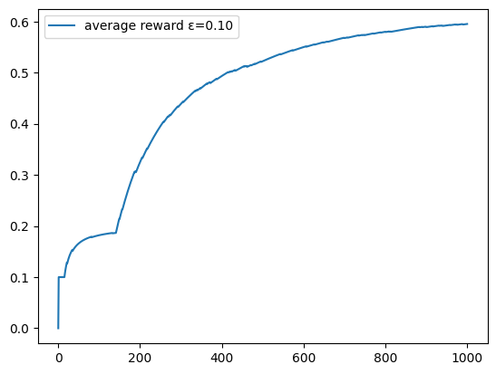
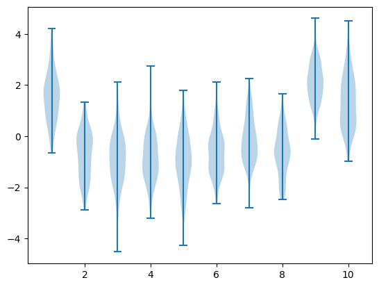
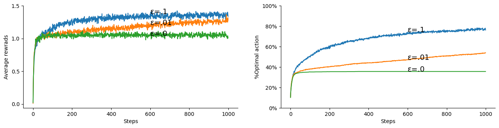

# Lesson 2- Understanding Q via K-armed Bandit


In this lesson, you will learn about the k-armed bandit problem and its applications in reinforcement learning (RL). This problem is useful for understanding the basics of RL, particularly how an algorithm can *learn* an action-value function, commonly denoted as Q in RL.

## Learning Outcomes

By the end of this lesson, you will:

1. Understand the role the action-value function plays in RL and its relationship with a policy.
2. Appreciate the difference between stationary and non-stationary problems.
3. Understand how to devise a sample-averaging solution to approximate an action-value function.
4. Appreciate the different types of policies and the role a policy plays in RL algorithms.


In this lesson, we develop the foundational concepts of actions and policies, which are the key elements that distinguish RL from other machine learning sub-disciplines. We study a simple yet effective problem: the k-armed bandit. This problem can be applied to scenarios such as a medical specialist deciding which treatment to administer to a patient from a set of medications, some of which they are trying for the first time (exploring).

Our toy problem is similar to the classic bandit problem, but with the assumption that there is a set of **k** actions the agent can choose from. The goal is to develop an effective policy that allows the agent to maximize its returns (wins). The bandit is assumed to have a Gaussian distribution centered around a mean reward, which differs for each action (arm). Each time an arm is pulled (or an action is taken, as we say in RL terminology), the bandit will return a reward (positive or negative) by drawing from its Gaussian reward distribution. The agent's task is to identify which action has the highest mean reward and consistently choose it to maximize its wins. Note that the distributions are fixed and do not change, though we will relax this assumption later.

Now, let’s get started!

## Motivating Example

Let us assume that we have an armed bandit with two levers.

### Scenario A
- We have a deterministic reward function that returns a reward of -5 for action $a_1$ (pulling bandit 1).
- We have a deterministic reward function that returns a reward of 0 for action $a_2$ (pulling bandit 2).

**Question**: What is the optimal policy for this bandit?

### Scenario B
- We have a nondeterministic reward function that returns a reward of either -5 or 15, each with an equal probability of 0.5 for action $a_1$ (pulling bandit 1).
- We have a nondeterministic reward function that returns a reward of either 0 or 10, each with an equal probability of 0.5 for action $a_2$ (pulling bandit 2).

**Questions**:

1. What is the net overall reward for actions $a_1$ and $a_2$?
2. What is the optimal policy for this bandit?
3. How many optimal policies do we have for this bandit?

### Scenario C
- We have a nondeterministic reward function that returns a reward of either -5 or 15, with probabilities of 0.4 and 0.6 respectively for action $a_1$ (pulling bandit 1).
- We have a nondeterministic reward function that returns a reward of either 0 or 10, each with a probability of 0.5 for action $a_2$ (pulling bandit 2).

**Questions**:

1. What is the net overall reward for actions $a_1$ and $a_2$?
2. What is the optimal policy for this bandit?
3. How many optimal policies do we have for this bandit?
4. Can you find a way to represent this?

---

The figure below gives an insight about some of the above questions. Each line represents a bandit Q1 and Q2.
    


As can be seen, the two bandit functions intersect with each other at a probability of 0.5, meaning they are equivalent at this probability. For other probabilities, Bandit 1 is superior for \( pr > 0.5 \) (and hence the optimal policy will be to select this bandit always), while Bandit 2 is superior for \( pr < 0.5 \) (and hence the optimal policy will be to select this bandit always). However, bear in mind that we do not know the underlying probability beforehand, and we would need to try out both bandits to estimate their corresponding value functions in order to come up with a suitable policy.

Now, let's move on to covering the different concepts of the multi-armed bandit in more detail.

We proceed by developing simple functions for:
1. Averaging rewards for statinary policy.
2. Moving Average of rewards for non-stationary policy.

<!-- 1. Returning an action from a stationary policy.
2. Returning a simple fixed reward from a stationary distribution. -->

## Averaging the Rewards for Greedy and ε-Greedy Policies

A greedy policy is a simple policy that always selects the action with the highest action-value. On the other hand, an ε-greedy policy is similar to a greedy policy but allows the agent to take random exploratory actions from time to time. The percentage of exploratory actions is designated by ε (epsilon). Typically, we set ε to 0.1 (10%) or 0.05 (5%). A third type of greedy policy is the dynamic ε-greedy policy, which anneals or decays the exploration factor (ε) over time. In practice, the ε-greedy policy generally works well and often better than more sophisticated policies that aim to strike a balance between exploration and exploitation (where taking the greedy action is called exploitation, and taking other actions is called exploration). Regardless of the approach, we need to allow for some exploratory actions; otherwise, it would not be possible for the agent to improve its policy.

Below, we show an implementation of a bandit function that uses an ε-greedy policy. `nA` denotes the number of actions (the number of arms to be pulled). Since we are only dealing with actions, the Q-function has the form of Q(a). The armed bandit is a non-associative problem, meaning we do not deal with states. Later, we will address associative problems, where Q(s, a) has two inputs: the state and the action.

We now create a function that takes a bandit (in the form of a set of rewards, each corresponding to an action) and generates a value Q that quantifies the value/benefit obtained by taking each action. This is a simple improvement over the earlier code, where we calculated the expected reward of an action. This time, we choose actions *randomly instead of uniformly*, so we need to keep track of each action. At the end, we divide the sum of the obtained rewards by the count of each action to compute the average, which serves as a good estimator of the expected reward.


```python
def Q_bandit_fixed(bandit, ε=.1, T=1000):
    r  = bandit      # the bandit is assumed to be a set of rewards for each action
    nA = len(r)      # number of actions
    Q = np.zeros(nA) # action-values
    C = np.ones(nA)  # action-counts
    avgR = np.zeros(T+1)
    
    for t in range(T):
        # ε-greedy action selection (when ε=0 this turns into a greedy selection)
        if rand()<= ε: a = randint(nA)
        else:          a = (Q/C).argmax()
        
        Q[a] += r[a]
        C[a] += 1
        avgR[t+1] = (t*avgR[t] + r[a])/(t+1)

        
    plt.plot(avgR, label='average reward ε=%.2f'%ε)
    plt.legend()
    return Q/C
```

Let us see how the Q_bandit_fixed will learn to choose the best action that yields the maximum returns.


```python
Q_bandit_fixed(bandit=[.1, .2, .7])
```
    array([0.09772727, 0.19874214, 0.699125  ])
    

    


As we can see it has improved to more than 0.6.

Let us see how the completely greedy policy would do on average:


```python
Q_bandit_fixed(bandit=[.1, .2, .7], ε=0)
```
    array([0.0999001, 0.       , 0.       ])

    

    


As we can see it could not improve beyond 0.1

The main restriction in Q_bandit_fixed( ) function is that we assume that the reward function is fixed (hence the name Q_bandit_fixed). I.e., each action will receive a specific reward that does not change. This made the above solution a bit excessive since we could have just summed the rewards and then took their max. Nevertheless, this is useful as a scaffolding for our next step.

In the next section we develop a more general armed-bandit function that allows for the reward to vary according to some *unknown* distribution. The Q_banditAvg function will learn the distribution and find the best action that will allow it to obtain a maximal reward on average, similar to what we have done here.

## 10-armed Bandet Testbed: Estimating Q via Samples Average

Remember that Q represents the average/expected reward of an action from the start up until time step $t$ exclusive. Later we will develop this idea to encompass what we call the expected return of an action.
q* (qˣ in the code) represents the actual action-values for the armeds which are a set of reward that has been offset by a normal distribution randn(). This guarantees that on average the rewards of an action a is q*[a] but it will make it not easy for an observer to know exactly what the expected reward is.

### Generate the experience(sampling)
generate an experience (rewards)


We use a function that get us a multivariate normal distribution of size k. Below see how we will generate a sample bandit with all of its possible data and plot it.


```python
def generate_a_bandit_data(qˣ, T):
    nA = qˣ.shape[0]
    r = multivariate_normal(qˣ, np.eye(nA), T)
    plt.violinplot(r)
    plt.show()

generate_a_bandit_data(normal(0, 1, 10), T=100)
```
    

    


### Learning the bandit Q action-values

Now we turn our attention to learning the Q function for an unknown reward distribution. Each action has its own Gaussian distribution around a mean but we could use other distributions. The set of means are themselves drawn from a normal distribution of mean 0 and variance of 1.


```python
# learn the Q value for bandit and use it to select the action that will win the most reward
def Q_banditAvg(qˣ, ε=.1, T=1000):    
    
    # |A| and max(q*)
    nA   = qˣ.shape[0]            # number of actions, usually 10
    amax = qˣ.argmax()            # the optimal action for this bandit

    # stats.
    r  = np.zeros(T)                  # reward at time step t
    a  = np.zeros(T, dtype=int)       # chosen action at time step t, needs to be int as it will be used as index
    oA = np.zeros(T)                  # whether an optimal action is selected at time step t
    
    # estimates
    Q = np.zeros(nA)                  # action-values all initialised to 0
    N = np.ones(nA)                   # actions selection count

    
    for t in range(T):
        # action selection is what prevents us from vectorising the solution which must reside in a for loop
        if rand()<= ε: a[t] = randint(nA)       # explore
        else:          a[t] = (Q/N).argmax()    # exploit
        
        # update the stats.
        r[t]  = bandit(a[t], qˣ)
        oA[t] =        a[t]==amax
        
        # update Q (action-values estimate)
        N[a[t]] += 1
        Q[a[t]] += r[t] 

    return r, oA
```

Let us now run this function and plot one 10-armed bandits


```python
R, oA = Q_banditAvg(normal(0, 1, 10) , ε=.1, T=1000)

plt.gcf().set_size_inches(16, 3.5)
plt.subplot(121).plot(R); plt.xlabel('Steps'); plt.ylabel('Average rewrads')
plt.subplot(122).plot(oA,'.'); plt.xlabel('Steps'); plt.ylabel('%Optimal action')

```
    

    


Note how the % of optimal actions for one trial (run) takes either 1 or 0. This figure to the left seems not be conveying useful information. However when we average this percentage over several runs we will see a clear learning pattern. This is quite common theme in RL. We often would want to average a set of runs/experiments due to the stochasticity of the process that we deal with.

### Multiple runs (aka trials)
We need to average multiple runs to obtain a reliable unbiased results that reflect the expected performance of the learning algorithm. We do that via running the same function or algorithm multiple times, which is what the Q_bandits_runs function does. We do not show the code, we only show 

Note that we obtain different set of 10-bandit distributions and conduct an experimental run on them. Because all of them are normally standard distribution their sums of rewards (values) converges to the same quantity around 1.5.


### Action Selection (Policy) Comparison:
Now we are ready to compare between policies with different exploration rates ε. Note that ε kw(keyword argument) has been passed on to the Q_bandit() function from the Q_bandits_runs() function.

```python
Q_bandits_runs(ε=.1,  label='ε=.1',  Q_bandit=Q_banditAvg)
Q_bandits_runs(ε=.01, label='ε=.01', Q_bandit=Q_banditAvg)
Q_bandits_runs(ε=.0,  label='ε=.0' , Q_bandit=Q_banditAvg)
```
    

    


As we can see the ε=.1 exploration rate seems to give us a sweet spot. Try ε=.2 and see the effect.
This empirically indicates that indeed we need to allow the agent to explore in order to come up with a viable optimal or close to optimal policy.

## Incremental Implementation

If we look at the sum

$$
% \begin{aligned}
Q_{t+1}  = \frac{1}{t}\sum_{i=1}^{t}R_i = \frac{1}{t}\left(\sum_{i=1}^{t-1}R_i + R_t\right) 
        = \frac{1}{t}\left((t-1)\frac{\sum_{i=1}^{t-1}R_i}{t-1} + R_t\right) 
        = \frac{1}{t}\left(\left(t-1\right)Q_t + R_t\right) 
$$

$$
Q_{t+1} = Q_t + \frac{1}{t}\left(R_t - Q_t\right) 
$$
<!-- % \end{aligned} -->
<!-- $$ -->
We can see that we can write the estimate in an incremental form that allows us to update our estimate $Q_t$ instead of recalculate the sum in each time step. This is very handy when it comes to efficiently implement an algorithm to give us the sum. Further, it  turns out that it also has other advantages. To realise this, note that the $\frac{1}{t}$ diminishes when $t$ grows, which is natural for averages. But if we want the latest rewards to have a bigger impact (weights) then we can simply replace this fraction by a constance$\alpha$ to obtain the following **incremental update**

$$
    Q_{t+1} = Q_t + \alpha\left(R_t - Q_t\right)
$$

Note that incremental updates plays a very important role in RL and we will be constantly seeking them due to their efficiency in online application.

Below we show the results of running a code that was designed to capture the ideas of incremental implementation via a function called Q_banditN. *We do not show the code of Q_banditN here*


```python
#Q_bandits_runs(ε=.2)
Q_bandits_runs(ε=.1,  label='ε =.1',  Q_bandit=Q_banditN)
Q_bandits_runs(ε=.01, label='ε =.01', Q_bandit=Q_banditN)
Q_bandits_runs(ε=.0,  label='ε =.0',  Q_bandit=Q_banditN)
```
    

    


## Non-stationary Problems
The limitation of the above implementation is that it requires actions counts and when the underlying reward distribution changes (non-stationary reward distribution) it does not respond well to take these changes into account. A better approach when we are faced with such problems is to use a fixed size step <1 instead of dividing by the actions count. This way, because the step size is small the estimate gets updated when the underlying reward distribution changes. Of course this means that the estimates will keep changing even when the underlying distribution is not changing, however in practice this is not a problem when the step size is small enough. This effectively gives more weights to recent updates which gives a good changes-responsiveness property for this and similar methods that use a fixed size learning step $\alpha$.

```python
# returns one of the max Q actions; there is an element of stochasticity in this policy
def greedyStoch(Q):   
    return choice(np.argwhere(Q==Q.max()).ravel())


# returns the first max Q action most of the time (1-ε)
def εgreedy(Q, ε):
    return Q.argmax() if rand() > ε else randint(Q.shape[0])
    

def εgreedyStoch(Q, ε):
    return greedyStoch(Q) if rand() > ε else randint(Q.shape[0])
```


```python
def Q_banditα(qˣ,  α=.1, ε=.1, T=1000, q0=0, policy=εgreedy):
    nA, amax, r, a, Q, _ = bandit_init(qˣ, T, q0)
    
    for t in range(T):
        # using a specific policy
        a[t] = policy(Q, ε)               
        
        # get the reward from bandit
        r[t]  = bandit(a[t], qˣ)
        
        # update Q (action-values estimate)
        Q[a[t]] += α*(r[t] - Q[a[t]])  
        
        
    return r, a==amax
```

Note that the majority of RL problem are actually non-stationary. This is because, as we shall see later, when we gradually move towards an optimal policy by changing the Q action-values, the underlying reward distribution changes in response to taking actions that are optimal according to the current estimation. This is also the case here but in a subtle way.


### Compare different learning rates
Let us compare different *learning rates* α to see how our Q_bandits() function reacts to them. 


```python
Q_bandits_runs(α=.1,  label='α=.1',  Q_bandit=Q_banditα)
Q_bandits_runs(α=.01, label='α=.01', Q_bandit=Q_banditα)
Q_bandits_runs(α=.5,  label='α=.5',  Q_bandit=Q_banditα)
Q_bandits_runs(α=.0,  label='α=.0',  Q_bandit=Q_banditα)
```
    

    

### Policies: Exploration vs. Exploitation
Getting the right balance between exploration and exploitation is a constant dilemma in RL.
One simple strategy as we saw earlier is to explore constantly occasionally ε% of the time! which we called ε-greedy. Another strategy is to insure that when we have multiple actions that are greedy we chose ebtween them equally and not bias one over the other. This is what we do in the greedyStoch policy below.

Let us now compare different exploration rates for this learning function. As before we show the results only not the code.


```python
Q_bandits_runs(ε=.1,  label='ε=.1',  Q_bandit=Q_banditα, T=5000, runs=2000)
Q_bandits_runs(ε=.01, label='ε=.01', Q_bandit=Q_banditα, T=5000, runs=2000)
Q_bandits_runs(ε=.0,  label='ε=.0',  Q_bandit=Q_banditα, T=5000, runs=500)
```    

 


### Optimistic Initial Values as an Exploration Strategy

It turns out that we can infuse exploration in the RL solution by optimistically initialising the Q values.
This encourages the agent to explore due to its disappointment when its initial Q values are not matching the reward values that are coming from the ground (interacting with the environment). This intrinsic exploration motive to explore more actions at the start, vanishes with time when the Q values become more realistic. 

This is a good and effective strategy for exploration. But of course it has its limitations, for example it does not necessarily work for if there a constant or renewed need for exploration. This could happen either when the task or the environment are changing. Below, we show the effect of optimistically initiating the Q values on the 10-armed bandit testbed. We can clearly see that without exploration i.e. when ε=0 and Q=5 initial values outperformed the exploratory policy ε=.1 with Q=0 initial values.

Ok, we will apply the same principle to stochastically return one of the max Q actions which is coded in greedyStoch() policy. This type of policy will prove useful later when we deal with control.


```python
Q_bandits_runs(ε=.1, q0=0, label='ε=.1  Realistic Q=0',  Q_bandit=Q_banditα, policy=εgreedyStoch)
Q_bandits_runs(ε=0 , q0=5, label='ε=0   Optimistic Q=5', Q_bandit=Q_banditα, policy=εgreedyStoch)
```
    

    


As we can see above the optimistic initialization has actually beaten the constant exploration rate and it constitutes a very useful trick for us to encourage the agent to explore while still acting greedily. Of course we can combine both strategies and we will leave this for you as a task. We will use this trick in our coverage of RL in later lessons.

## Conclusion
In this lesson you have learned about the importance of the action value function Q and stationary and non-stationary reward distribution and how we can devise a general algorithms to address them and we concluded by showing an incremental learning algorithm to tackle the k-armed bandit problem. You have seen different exploration strategy and we extensively compared between exploration rates and learning rates for our different algorithms.

## Further Reading

For further information refer to chapters 1 and 2 of the [rl book]((http://incompleteideas.net/book/RLbook2020.pdf)). 
<!-- Please note that we approach the ideas in this lesson from a practical perspective, which complements the theoretical coverage in the textbook. -->

## Your Turn

[Worksheet2](../../workseets/worksheet2.ipynb) implement the above concepts and more. Please experiment with the code and run it to get familiar with the essential concepts presented in the lessons.

<!-- 1. Define a softmax policy as per its definition in eq. 2.11, then compare the Q_bandits_runs on ε-greedy and softmax policies.
1. Combine the optimistic initialisation and exploration rates and see how the bandit_Q function react to them.
 -->
