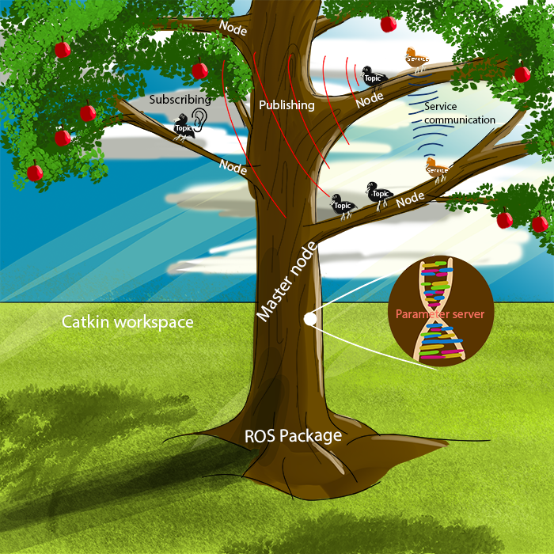

# ROS 2 Basics and Fundamentals


Please see the following video to get started with teh VM. 


<video width="470" height="200" controls>
  <source src="/videos/1. Introduction to Azure VM.mp4" type="video/mp4">
  Wecome Video
</video>

<!-- <iframe src="https://leeds365-my.sharepoint.com/personal/scsaalt_leeds_ac_uk/_layouts/15/embed.aspx?UniqueId=f52d3061-e7ab-4c0f-9e5d-04dbd2e3bc95&embed=%7B%22ust%22%3Atrue%2C%22hv%22%3A%22CopyEmbedCode%22%7D&referrer=StreamWebApp&referrerScenario=EmbedDialog.Create" width="640" height="360" frameborder="0" scrolling="no" allowfullscreen title="1- Introduction to Azure VM.mkv"></iframe> -->


You should recieve an email inviting you to have access to an Azure VM. The VM has [ROS 2 Foxy Fitzroy](https://docs.ros.org/en/foxy/Installation.html) already installed. ROS2 commands need to be run from the terminal not from a conda-activated terminal (due to compatibility), and they use the default system Python 3.8. The VM has the libraries required for ROS2 along with TurtleBot3 installed with the worlds required for assessment.

We have tested the notebooks on Python 3.8, so they should work smoothly for higher versions.
Note that ROS2 code must be run with the default VM Python3.8 kernel. For the best experience, use VScode

The machine has decent cores and memory (according to Azure 4 cores | 8GB RAM | 128GB Standard SSD). The VM has Ubuntu 20 and Xfce (Xubuntu) interface due to its lightweight (to give you the best experience remotely- to come as close as a local machine feeling) and it is tailored to give the same feeling as the usual Ubuntu Genome. You can run hardinfo in the terminal to check the VM specs. I hope you will enjoy it. 

To access the VM, please use the usual remote desktop app available on your system. You will receive an email with access to your VM. The username is rl, and the password is rl@ros2. 


You will have sudo access. Please apply caution when dealing with the system and avoid installing packages so as not to break it, which can be time-consuming. You will have around a 40-hour time limit, so please be mindful not to leave the system running unless necessary so as not to run out of time. Usually, you would want time for running the exercises and save plenty of time (1/2) for your project training (this is where the VM will be most useful).

If the VM becomes corrupted for some reason, then you can reimage it by going to Azure Lab page and selecting the three dots, then reimage. That *will cause all the data you have on the machine to be lost*. You are advised to back up your data, you may want to use OneDrive or other backup methods.

## Introduction to ROS 2

Robot Operating System (ROS) 2 is an open-source framework for building robot applications. It provides a collection of tools, libraries, and conventions to help developers build robot software. ROS 2 is the next generation of ROS, with improvements in architecture, communication, and performance.

### Key Concepts in ROS 2

1. **Node**:
   A node is a fundamental unit in ROS 2. It is a process that performs computation. Nodes can communicate with each other through topics, services, and actions.

2. **Package**:
   A package is a collection of files that support a specific functionality. A package may include nodes, libraries, configuration files, and more.

3. **Topic**:
   Topics are a means of communication between nodes. Nodes can send data to topics (publishing) or receive data from topics (subscribing). They are used for asynchronous communication in ROS 2.

4. **Publisher and Subscriber**:
   - **Publisher**: A node that sends data to a topic.
   - **Subscriber**: A node that receives data from a topic.

5. **Service**:
   Services are a synchronous communication mechanism in ROS 2 where a request is made by one node and a response is provided by another.

6. **Action**:
   Actions are similar to services but allow for more complex interactions, such as monitoring progress, canceling tasks, or receiving feedback.


## Setting Up ROS 2
You do not have to set up anything since you are given access to the ready setup VM. Before starting, ensure that you have ROS 2 installed on your system. 
<!-- For installation instructions, visit the official ROS 2 documentation: [ROS 2 Installation](https://docs.ros.org/en/foxy/Installation.html). -->

Usually you do not need to source the ROS 2 workspace by running the following command:

```bash
source /opt/ros/foxy/setup.bash
```
because we stored this in a file that will be run everytie you open the terminal. 



[picture credit](https://ktiwari9.gitlab.io/ros101/JargonSection.html)


## Your turn

Now go ahead and try doing worksheet4 to experiement more with some of the ros concepts. [ROS Worksheet 4: Robotics Operating System](worksheet4.md)

- Explore other features of the Turtlesim package, such as controlling the turtle’s position.
- Learn about ROS 2 services and actions for more interactive communication between nodes.
- Start developing your own custom ROS 2 nodes and packages for real-world robotics applications.

## Summary
In this lesson, you have learned the following ROS 2 concepts:

- Nodes: We created a TurtleControl node that publishes messages.
- Packages: We created a package to encapsulate our node.
- Topics: We used the /turtle1/cmd_vel topic to control the turtle.

By following this tutorial, you have gained a basic understanding of how to interact with ROS 2 using packages, nodes, and topics. 
<!-- You can now explore more advanced ROS 2 concepts, such as services and actions, and create more complex robot applications. -->

