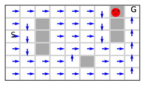
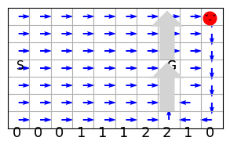

<script>
  window.MathJax = {
    tex: {
      tags: "ams",  // Enables equation numbering
    //   displayMath: [['$$', '$$'], ['\\[', '\\]']]
    }
  };
</script>

# Lesson 5- Dynamic Programming: Model-Based Approach

**Unit 2: Learning Outcomes**  
By the end of this unit, you will be able to:  

1. **Compute** the value function for a given policy in tabular settings.  
2. **Implement** control methods that infer an agent’s policy from an action-value function.  
3. **Explain** the concept of Generalized Policy Iteration (GPI) and how it underpins many RL methods.  
4. **Compare** full-backup action-value-based control methods with direct policy estimation control methods.  
5. **Evaluate** how Monte Carlo (MC) methods provide unbiased but high-variance estimates through interaction with the environment.  
6. **Analyze** how REINFORCE achieves unbiased but high-variance policy gradient estimation through interaction with the environment.  

---

In the first lesson, you looked at a basic RL problem, the k-arm bandit, which involves only actions and no states (non-associative problem). In general, in RL, we are faced with different situations, and we need to take different actions in each situation in order to achieve a certain goal. This general type of environment with states and actions imposes a different flavour to the solution we can design. From now on, we will tackle associative problems. For associative problems, there are two approaches:

1. Model-based approach
2. Model-free approach

In this lesson, we will take the first approach. We will learn how to use a model of the environment to solve an RL problem. The model is given in the form of the dynamics of the environment. These usually come in the form of 4 dimensions of conditional probability involving an answer to the following question: what is the probability of obtaining a certain reward r in a certain state s' given that the agent was previously in a state s and applied action a.

We will assume that there is already a model for the environment and try to take advantage of this model to come up with the best policy. Nevertheless, we will see simple ways to build such models and come back to this question later when we tackle planning algorithms in RL.


**Plan**
As usual, in general there are two types of RL problems that we will attempt to design methods to deal with 
1. Prediction problem
For These problems we will design Policy Evaluation Methods that attempt to find the best estimate for the value-function given a policy.


2. Control problems 
For These problems we will design Value Iteration methods which utilise the idea of Generalised Policy Iteration. They attempt to find the best policy, via estimating an action-value function for a current policy then moving to a better and improved policy by choosing a greedy action often.


## Inducing the dynamics by interacting with the environment

We cover obtaining the dynamics from an actual environment in the practicals. We will use mainly the random walk environment and the grid world environment and generate their dynamics. These are deterministic simple environments. Nevertheless, they are very useful to demonstrate the ideas of RL. 

Note that when we move to the real world the dynamics become much more complex and building or obtaining the dynamic becomes impractical in most cases. Therefore, towards that end instead of dealing directly with the environment's dynamics, we will see later how we can substitute this requirement by having to *interact* with the environment to gain *experience* which will help us *infer* a good *estimate* of the *expected* value function (discounted sum of rewards) which in turn will help us to *infer* a close to *optimal policy* for the task in hand. 

The exercise of dealing with probabilities and then using them in designing a Dynamic Programming solution is valuable since most of the other solutions utilise the basic ideas (policy iteration, value iteration algorithms and policy improvements theorem) that we cover here and will mainly show us that we can devise a form of Bellman equation that is suitable for interaction, where we use sampling, model-free algorithms instead of using probabilities(dynamics), model-based algorithms. 

Dynamic programming suffers from what Bellman described as the curse of dimensionality which indicates that the computational resources required to solve a problem grow exponentially with the dimensionality of the problem. So in our case, the dimensionality is the number of states (as well as actions and rewards). So for example if the dynamic programming solution computational complexity is $2^{|S|}$ and the number of states $|S|=10$ then it costs $2^{10}=1024$ but when the number of states $|S|$ grows to 100 the cost becomes $2^{100}=1267650600228229401496703205376$.


## Sources Stochasticity- Dynamics and Policy

One important point to make is that stochasticity comes from different elements of the MDP and from the policy itself.

1. There might be stochasticity in the dynamics at the state transition level,
   where applying action $a$ in a state $s$ may cause the agent to transition to different states, each with a different probability
1. There might be stochasticity in the dynamics at the reward level,
   where applying action $a$ in a state $s$ may result in different rewards, each with a certain probability
  
1. There might be stochasticity in the policy itself,
   where the policy applies different actions in a state $s$  with different probabilities
   
1. There might be stochasticity or randomness in observing the current state due to the complexity of the state space. 
   For example, when a robot moves around in the environment, after a while, we cannot reliably designate its position from its motor encoders even when we know the start position due to dead-reckoning. This is called partial observability, and there is a framework called BOMDP or partially observable MDP to tackle this problem. However, we will not study this branch. The field is divided about the necessity of BOMDP with a line of thought that considers that we can overcome this difficulty by encoding our states differently but staying in the MDP framework.

These sources of stochasticity dictate using suitable techniques to obtain the dynamics and to evaluate or improve stochastic and deterministic policy. You will see an implementation of this in the associated worksheet.


# Dynamic Programming Methods

Ok so we are ready now to move to Dynamic programming algorithms to solve the RL problem of finding a best estimate of a value function and or finding an optimal policy. Dynamic Programming (DP) refers to a collection of algorithms used for solving Markov Decision Processes (MDPs). DP methods rely on the principle of optimality and require a known model of the environment (transition probabilities and rewards). The main algorithms used in DP are **Policy Evaluation**, **Policy Iteration**, and **Value Iteration**.

<video width="560" height="315" controls>
  <source src="/docs/videos/8. Dynamic Programming 1.mp4" type="video/mp4">
  Your browser does not support the video tag.
</video>

<iframe src="https://leeds365-my.sharepoint.com/personal/scsaalt_leeds_ac_uk/_layouts/15/embed.aspx?UniqueId=55e740c0-8e7f-4735-b5cd-3a8911e9fc16&embed=%7B%22ust%22%3Atrue%2C%22hv%22%3A%22CopyEmbedCode%22%7D&referrer=StreamWebApp&referrerScenario=EmbedDialog.Create"  width="470" height="200" frameborder="0" scrolling="no" allowfullscreen title="8. Dynamic Programming 1.mkv"></iframe>


<iframe src="https://leeds365-my.sharepoint.com/personal/scsaalt_leeds_ac_uk/_layouts/15/embed.aspx?UniqueId=da8f61f0-2c2d-4ec2-9ac1-ef73d31de388&embed=%7B%22ust%22%3Atrue%2C%22hv%22%3A%22CopyEmbedCode%22%7D&referrer=StreamWebApp&referrerScenario=EmbedDialog.Create"  width="470" height="200"frameborder="0" scrolling="no" allowfullscreen title="8. Dynamic Programming 2.mkv"></iframe>


## Policy Evaluation

The first step to improving any policy is to evaluate how good or bad the policy is for the given task. This fundamental question can be addressed by tying up the task with a reward function that basically rewards the agent for achieving the task or a subtask that leads to the final goal. The agent's aim then becomes to collect as many rewards as possible (or to incur as few losses as possible), which should help the agent achieve the given task. One example is when a robot is moving in an environment, and we want it to reach a specific location, then we can reward/punish the robot for each step that is taking it close to the goal or away from it. But this awareness of the goal location is usually difficult to attain in real environments. Hence it is replaced by rewarding the agent when it reaches the goal or punishing the agent for each step taken without reaching the goal location.

We can devise an evaluation strategy based on the discounted sum of rewards the agent is *expected* to collect while executing the task. The strategy depends on the dynamics of the environment. You may want to read section 4.1 and come back here to continue reading the code for the policy evaluation algorithm to get an insight into how it works.


<iframe src="https://leeds365-my.sharepoint.com/personal/scsaalt_leeds_ac_uk/_layouts/15/embed.aspx?UniqueId=7523c957-a9cb-4e87-b55c-1c449702ba9c&embed=%7B%22ust%22%3Atrue%2C%22hv%22%3A%22CopyEmbedCode%22%7D&referrer=StreamWebApp&referrerScenario=EmbedDialog.Create"  width="470" height="200" frameborder="0" scrolling="no" allowfullscreen title="9. policy evaluation.mkv"></iframe>

In summary, policy evaluation computes the **state-value function** \( V^{\pi} \) for a given policy \( \pi \). It determines how good it is to follow a specific policy in an MDP. Below we show the pseudocode for this algorithm. *Bellman equation is the basis of the update used in policy evaluation algorithm.*

### Policy Evaluation Algorithm:

\(
\begin{array}{ll}
\textbf{Algorithm: }  \text{Policy Evaluation} \\
\textbf{Input: }  \text{MDP } (S, A, R, p, \gamma), \text{ Policy } \pi, \text{ Threshold } \theta \\
\textbf{Initialize: }  V(s) \leftarrow 0, \forall s \in S \\
\textbf{Repeat:}  \\
\quad \Delta \leftarrow 0 \\
\quad \textbf{For all } s \in S:  \\
\quad \quad v \leftarrow V(s) \\
\quad \quad V(s) \leftarrow \sum_{a \in A} \pi(a | s) \sum_{s', r} p(s',r | s, a) [r + \gamma V(s')] \\
\quad \quad \Delta \leftarrow \max(\Delta, |v - V(s)|) \\
\textbf{Until:}  \Delta < \theta \\
\textbf{Return:}  V^{\pi}(s), \forall s \in S
\end{array}
\)
    
The existence and uniqueness of $v_\pi$ guaranteed as long as either  $\gamma< 1$ or eventual termination is guaranteed from all states under the policy $\pi$. 
Note that $\gamma$ must be $< 1$ to guarantee convergence of the Bellman equation because, in general, we do not know whether the policy guarantees reaching a terminal(goal) state; if we do, then $\gamma=1$ is ok. 
<!-- This condition can be relaxed when we move to sampling instead of dynamic programming in the next consequent lessons. -->

## Policy Improvement Theorem
The **Policy Improvement Theorem** states that if for all states:

\[
Q_{\pi}(s, a^*) > V_{\pi}(s)
\]

where \( a^* = \arg\max_a Q_{\pi}(s, a) \), then choosing \( a^* \) instead of the action dictated by \( \pi \) results in a strictly better policy. This theorem justifies **Policy Iteration**.

Based on this important theorem, we can then devise an algorithm that improve our policy. A natural way to do this to first evaluate the current policy then improve it, then evaluate the improved policy and then improve it, and so on until the policy stabilise which means we reached an optimal policy that cannot be improved any more. This idea of *iteratively* improving the policy constitute the base for two algorithms that we cover, Policy Iteration and Value Iteration.

## Policy Iteration
Now that we know how to evaluate a policy, it is time to improve it. Policy iteration is a fundamental algorithm. It explicitly and iteratively tries first to reach a highly accurate estimate of the value function of the current policy, then it tries to improve the policy by maximising the probability of greedy actions as per the current value function. Evaluating the current policy fully and then improving it via policy iteration can be inefficient, but it shows the fundamental ideas behind reinforcement learning. 

Policy Iteration is an iterative process to find the optimal policy \( \pi^* \). It consists of two alternating steps:

1. **Policy Evaluation:** Compute \( V^{\pi} \) using the policy evaluation algorithm.
2. **Policy Improvement:** Improve the policy by acting greedily with respect to \( V^{\pi} \):
   \(
   \pi'(s) = \arg\max_a \sum_{s'} P(s' | s, a) [R(s, a, s') + \gamma V(s')]
   \)
3. Repeat until \( \pi \) converges to \( \pi^* \).

So as you can see the policy improvement step is based on *Bellman Optimality equation*.
Belwo we show the pseduocode for thsi algorithm.

### Policy Iteration Algorithm:
\(
\begin{array}{ll}
\textbf{Algorithm: }  \text{Policy Iteration} \\
\textbf{Initialize: } \pi \text{ arbitrarily} \\
\textbf{Repeat:}  \\
\quad \text{Policy Evaluation (using above algorithm)} \\
\quad \text{Policy Improvement:} \\
\quad \quad \textbf{For all } s \in S: \\
\quad \quad \quad \pi'(s) \leftarrow \arg\max_a \sum_{s', r} p(s',r | s, a) [r + \gamma V(s')] \\
\quad \quad \quad \textbf{If } \pi'(s) \neq \pi(s) \text{ then policy is not stable} \\
\textbf{Until:} \pi \text{ is stable} \\
\textbf{Return:} \pi^*, V^{\pi^*}
\end{array}
\)


### Policy Iteration on a Maze Grid World

Let us try it on a slightly complex environment such as the maze.


```python
π = Policy_iteration(env=maze(), show=True)[0]
```
    

    
    policy evaluation stopped @ iteration 2:
    policy improvement stopped @ iteration 16:


## Value Iteration
Our final step to fully develop the ideas of dynamic programming is to shorten the time it takes for a policy to be evaluated and improved. One simple idea we will follow here is to slightly improve the evaluation and immediately improve the policy. We do these two steps iteratively until our policy has stopped to improve. This is a very effective strategy because we do not wait until the policy is fully evaluated to improve it; we weave and interleave the two loops together in one loop. 

Value Iteration is a special case of Policy Iteration where policy evaluation is truncated to a single update per state. Instead of evaluating a policy to convergence, we update the value function directly:
\[
V(s) \leftarrow \max_a \sum_{s'} P(s' | s, a) [R(s, a, s') + \gamma V(s')]
\]
This is a nifty idea since we are saving on most of the policy evaluation and suffice by just one **step** of evaluation per iteration that also incorporates a policy improvement step.
 *Bellman Optimality equation is the basis of the update used in value iteration algorithm.*
Below we show this algorithm. 

### Value Iteration Algorithm:
\(
\begin{array}{ll}
\textbf{Algorithm: }  \text{Value Iteration} \\
\textbf{Input: } \text{MDP } (S, A, R, p, \gamma), \text{ Threshold } \theta \\
\textbf{Initialize: } V(s) \leftarrow 0, \forall s \in S \\
\textbf{Repeat:}  \\
\quad \Delta \leftarrow 0 \\
\quad \textbf{For all } s \in S:  \\
\quad \quad v \leftarrow V(s) \\
\quad \quad V(s) \leftarrow \max_a \sum_{s', r} p(s',r | s, a) [r + \gamma V(s')] \\
\quad \quad \Delta \leftarrow \max(\Delta, |v - V(s)|) \\
\textbf{Until:}  \Delta < \theta \\
\textbf{Return:}  V^{*}(s), \forall s \in S
\end{array}
\)

### Key Differences Between Policy Iteration and Value Iteration
| Feature            | Policy Iteration | Value Iteration |
|-------------------|----------------|----------------|
| Policy Evaluation | Full evaluation | Single update |
| Convergence Speed | Slower, but fewer iterations | Faster updates, but more iterations |
| Computational Cost | Higher per iteration | Lower per iteration |


### Value Iteration on a Windy Grid World
Below we show the results of applying the value iteration method on a windy grid world. This is almost identical to the previous simple grid world without any obstacles, the only difference is that there is a wind blowing upwards, which shifts the agent 2 or 1 cell depending on its location. 


```python
Q = value_iteration(env=windy(), show=True)
```
    

    
Let us now apply the policy-iteration on the maze env.


```python
policy = value_iteration(env=maze(), show=True)
```

    
    loop stopped @ iteration: 14 , Δ =  0


## Conclusion

In this lesson, we covered the main dynamic programming algorithms. We saw how evaluating a policy was extremely useful in being the key component to allowing us to improve the policy. We then developed a policy iteration algorithm which improves the policy in two main steps:
1. a step that evaluates the policy fully to reach an accurate estimation of the action values of the current policy
2. a step that improves the policy by adopting a greedy action. The usage of an action-value function Q(s,a) was key in allowing us to choose between actions since the state-value function V(s) does not differentiate between the values of actions

We finally saw how the value-iteration algorithm has a similar structure to the policy-iteration algorithm with one important difference; it can arrive at an optimal policy by just taking a step *towards* the optimal policy by slightly refines its estimation of the action-value function without fully evaluating it.  Hence, it improves its policy more concisely and with much less overhead than the full policy iteration method.

In summary:

- **Policy Evaluation** computes \( V^{\pi} \) for a fixed policy.
- **Policy Improvement Theorem** ensures that improving a policy results in a better policy.
- **Policy Iteration** alternates between evaluation and improvement until convergence.
- **Value Iteration** updates values directly, skipping full policy evaluation.

These techniques form the foundation of solving MDPs using Dynamic Programming.
In the next lesson, we will take a different approach and move to cover sampling methods that do not use the dynamics of the environment explicitly and instead try to improve its policy by interacting with the environment.

**Further Reading**:
For further reading you can refer to chapter 4 from the Sutton and Barto [book](http://incompleteideas.net/book/RLbook2020.pdf).


## Your turn
Now it is time to experiemnt further and interact with code in [worksheet5](../../workseets/worksheet5.ipynb).

